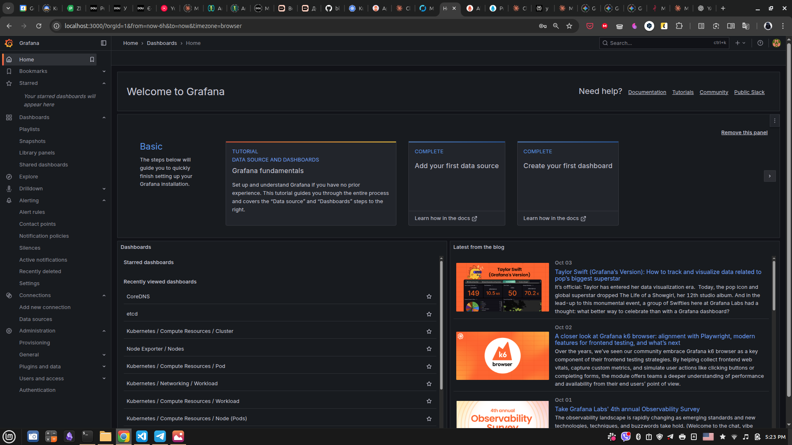

goit-mlops-hw-09

GoIT Neoversity module "MLOps" Homework 9


# Розгортання пайплайну тренування моделей, що складається з MLFlow, Minio, Prometeus, Grafana 

**Disclaimer:**
1. Для економії власних коштів проект розгортається в локальному кластері Kubernetes на одній віртуальній машині (ноді). В даному випадку кластер розгортається на одній ноді з такими характеристиками:
- ядер на ноду: 3
- RAM на ноду: 8 Gi
- дисковий простір на ноду: 20 Gi

2. Для тестування розгортання вирішено спростити схему зберігання - використати вбудовану в MLFlow СУБД SQLite для зберігання метаданих експериментів та локальну папку в кластері для зберігання артефактів. Але згодом стало зрозуміло, що т.я. тренування моделі виконується не в кластері, а на локальній машині, то цю схему треба мінімально модифікувати - встановити Minio для збереження артефактів в кластері. Було вирішено не розгортати PostgeSQL для економії часу, т.к. як в кожному чарті знаходиться купа багів, які важно аналізувати та виправляти.

## Опис проекту

Цей проект містить конфігурацію для розгортання, що включає:

- **minikube** - Kubernetes-емулятор для роботи з кластерами на локальному комп'ютері;
- **ArgoCD** - Kubernetes-додаток для розгортання інших Kubernetes-додатків використовуючи github-репозиторій, як джерело даних про їх конфігурацію (GitOps-підхід);
- **MLFlow** - Kubernetes-додаток для реалізації ML-pipeline;
- **Minio** - Kubernetes-додаток, що емулює S3-бакети для зберігання об'єктів;
- **Prometeus** - Kubernetes-додаток для збору логів;
- **Grafana** - Kubernetes-додаток для візуалізації та моніторінгу додатків;
- **Pushgateway** - Kubernetes-додаток для передавання метрик MLFlow в Prometeus.


## Архітектура

```
goit-mlops-hw-09/
│
├── minikube-cluster/                          # папка для tf-конфігурацій для розгортання кластеру
│   ├── main.tf                                  # оголошення terraform-файлу для підняття кластеру
│   ├── variables.tf                             # оголошення змінних
│   ├── outputs.tf                               # оголошення вихідних даних
│   └── check_amd_v.sh                           # скрипт відключення KVM для запуску minikube без помилок
│
├── argocd/                                    # папка для tf-конфігурацій для розгортання ArgoCD
│   ├── main.tf                                  # оголошення terraform-файлу для встановлення ArgoCD
│   ├── variables.tf                             # оголошення змінних
│   ├── outputs.tf                               # оголошення вихідних даних
│   ├── provider.tf                              # оголошення провайдерів 
│   ├── terraform.tf                             # оголошення платформи
│   └── backend.tf                               # зарезервовано згідно умов ДЗ
│
├── goit-mlflow-platform/                      # репозиторій з маніфестами інфраструктури ArgoCD-додатків
│   ├── README.md                                # опис репозиторію з інфраструктурою
│   ├── manifests                                # папка маніфестів для розгортання додатків з контейнерів
│   │   ├── minio/                               # папка маніфестів для розгортання Minio
│   │   │   ├── deployment.yaml                    # маніфест розгортання Deployment
│   │   │   ├── namespace.yaml                     # маніфест розгортання Namespace
│   │   │   ├── pvc.yaml                           # маніфест розгортання PersistantVolumeClaim
│   │   │   ├── secret.yaml                        # маніфест розгортання Secret
│   │   │   └── service.yaml                       # маніфест розгортання Service
│   │   └── mlflow/                              # папка маніфестів для розгортання MLFlow
│   │       ├── deployment.yaml                    #  маніфест розгортання Deployment
│   │       ├── pvc.yaml                           # маніфест розгортання PersistantVolumeClaim
│   │       ├── minio-secret-for-mlflow.yaml       # маніфест розгортання Secret для доступу до Minio
│   │       └── svc.yaml                           # маніфест розгортання Service
│   └── platform/                                # папка маніфестів для розгортання MLFlow
│       ├── minio-app.yaml                         # маніфест для розгортання Application Minio
│       ├── mlflow-app.yaml                        # маніфест для розгортання Application MLFlow
│       ├── monitoring.yaml                        # маніфест для розгортання Application Prometeus+Grafana+Alertmanager
│       └── pushgateway.yaml                       # маніфест для розгортання Application Pushgateway
│
├── mlflow-experiments/                       # папка скрипту тренування моделі
│   ├── .env                                    # файл з змінними середовища
│   ├── requirements.txt                        # файл з пакетами Python, які необхідно встановити
│   ├── s3-check.py                             # скрипт перевірки коректності створення бакету
│   ├── train.py                                # скрипт тренування моделі та логування метрик та артефактів
│   └── venv/                                   # папка віртуального оточення з встановленими пакетами
│       └ ...
│
├── imgs/                                     # папка для скріншотів для README.md
│   ├── 1.png
│   ...
│
├── port-forwarding.md                        # рядки для копі-пасту
└── README.md                                 # інструкція по розгортанню

```

## Передумови

- **Docker** для розгортання контейнерів
- **Terraform** >= 1.13 для розгортання інфраструктури
- **kubectl** для роботи з Kubernetes

## Запуск проекту

### 1. Відключення KVM за допомогою скрипта для роботи minikube без помилок

```bash
./check_amd_v.sh
```

### 2. Розгортання кластера, відкриття Kubernetes UI кластера в браузері

```bash
cd minikube-cluster
terraform init
terraform plan
terraform apply
minikube dashboard --url
```
**Результати:**
1. Кластер піднятий


2. Ноди працюють


### 3. Синхронізація локального репозиторія з Github

```bash
cd ../goit-mlflow-platform
git add .
git commit -m "readme.md adding"
git push
```
**Результати:**
1. Репозиторії синхронізовано


### 4. Розгортання ArgoCD в кластері

```bash
cd ../argocd
terraform init
terraform plan
terraform apply
kubectl -n argocd get secret argocd-initial-admin-secret -o jsonpath='{.data.password}' | base64 -d
kubectl port-forward svc/argocd-server -n argocd 8080:443
```

В браузері:
```browser
localhost:8080
```

**Результат:**
1. terraform-конфігурація встановлена, пароль до ArgoCD UI отриманий, зроблена переадресація портів для web-доступу


Можна запустити тестовий додаток для перевірки ArgoCD
```bash
kubectl apply -f test-guestbook-app.yaml
```

**Результати:**
1. Тестовий додаток створений


2. Тестовий додаток працює (видно в UI-кабінеті ArgoCD)


3. ArgoCD успішно під'єднаний до заданого репозиторію


4. ArgoCD успішно під'єднаний до локального кластера


### 5. Розгортання Minio, MLFlow, Prometeus+Grafana+Alertmanager, PushGateWay в кластері, як додатків ArgoCD

```bash
cd ../goit-mlflow-platform
kubectl apply -f platform/minio-app.yaml
kubectl apply -f platform/mlflow-app.yaml
kubectl apply -f platform/monitoring.yaml
kubectl apply -f platform/pushgateway.yaml
```

**Результати:**
1. Всі додатки ArgoCD створені і синхронізовані з репозиторієм


### 6. В окремих терміналах запускає порт-форвардінг для доступу до UI всіх сервісів

```bash
# MLFlow UI
kubectl port-forward -n mlflow svc/mlflow-service 5000:5000

# Minio API
kubectl port-forward -n minio svc/minio-service 9000:9000

# Minio UI
kubectl port-forward -n minio svc/minio-service 9001:9001

# AlertManager UI
kubectl -n monitoring port-forward svc/prometheus-operator-alertmanager 9093:9093

# Grafana UI
kubectl -n monitoring port-forward svc/prometheus-operator-grafana 3000:80

# PushGateWay UI
kubectl -n monitoring port-forward svc/prometheus-pushgateway 9091:9091
```

В браузері (в окремих вкладках):
```browser
localhost:5000
localhost:9001
localhost:9093
localhost:3000
localhost:9091
```

**Результати:**
1. MLFlow запущений


2. Minio запущений


3. Alertmanager запущений


4. Grafana запущена


5. Pushgateway запущений


### 7. Додаємо python-пакет boto3 в под MLFlow server.

```bash
kubectl get pods -n mlflow

# підставляємо отримане ім'я поду в наступну команду
kubectl exec -it mlflow-deployment-b69ff9b9-64zhj -n mlflow -- bash

# в терміналі всередині пода
pip install boto3
```
**Результати:**
1. Пакет boto3 встановлений в MLFlow-под


### 8. Встановлюємо віртуальне середовище, активуємо його, запускаємо тренування моделі

```bash
cd ../mlflow-experiments
pip install -r requirements.txt
source venv/bin/activate
python train.py
```

**Результати:**
1. Скрипт тренування відпрацював без помилок


2. Метадані з результатами тренування зафіксовані в MLFlow


3. Артефакти моделей зафіксовані в MLFlow


4. Артефакти моделей збережені в Minio


5. Метрики експериментів відображаються на дашборді в Grafana (на скріншоті - результати двох експериментів з різною кількістю епох)
